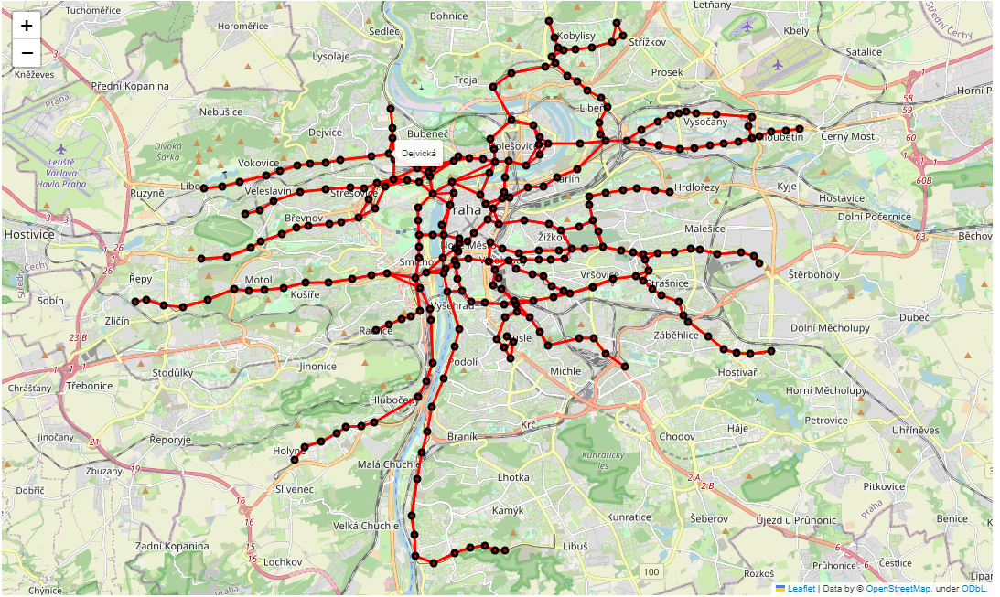

# Assignment 2 – Network Analysis of PID

## Task
Perform a network analysis of the Prague Integrated Transport (PID) system using open GTFS data (timetables and stop locations). The goal was to model the transport network as a graph, where nodes represent stops and edges represent connections between them. The task required **data cleaning**, **graph construction**, **visualization** on a map, and **analyzing the network** using centrality measures.

## Approach
- **Data Preparation:**
  - Loaded raw data and handled missing values.
  - Removed redundant columns and mapped numerical route types to text labels (Tram, Metro, Bus, etc.).
  - Fixed invalid time formats (GTFS times > 24:00:00) using modulo 24 arithmetic to convert them to standard datetime objects.
  - Aggregated stop coordinates by name to handle multiple platforms as a single node.

- **Network Construction:**
  - Focused specifically on the Tram network to ensure a readable and dense graph structure relevant to the city center.
  - Used `NetworkX` to build a weighted directed graph where edge weights correspond to the frequency of trips between stops.

- **Visualization:**
  - Plotted the graph structure using `Matplotlib` and `Seaborn`.
  - Created an interactive geospatial map using `Folium` to overlay the graph on the real map of Prague and verify the network topology.

- **Network Analysis:**
  - Calculated and interpreted three key metrics: Degree Centrality, Closeness Centrality, and Betweenness Centrality to identify hubs and critical bridges in the network.

- **Own Questions:**
  - Analyzed traffic density by hour to identify rush hours.
  - Analyzed traffic volume by day of week (Workdays vs. Weekends).
  - Compared frequency across different transport modes.

## Results
- Successfully reconstructed and visualized the Prague Tram network.
- Centrality analysis confirmed that stops in the city center act as the main hubs, while terminals have the lowest degree.
- Temporal analysis revealed distinct patterns: significantly lower traffic on weekends and standard rush hour peaks during workdays.
- The graph layout matched the actual physical infrastructure of Prague.

## Files
- `public_transport_network_analysis.ipynb` – Jupyter notebook with full solution.  
- `d.csv` – Main dataset with timetable data (Not included in this repository due to large file size).  
- `stops.csv` – Dataset containing geographical coordinates of stops.  
